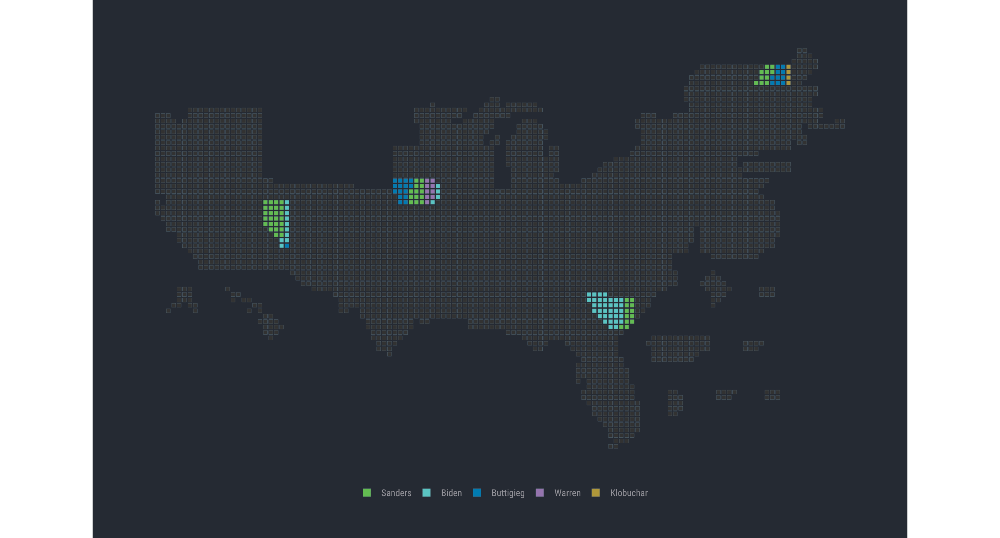

[](https://www.repostatus.org/#active)
[](https://keybase.io/hrbrmstr)

[](https://travis-ci.org/hrbrmstr/catchpole)  


# catchpole

catchpole title goes here otherwise CRAN checks fail

## Description

A good description goes here otherwise CRAN checks fail.

## What’s Inside The Tin

The following functions are implemented:

  - `gg_catchpole`: Plot a U.S. Democratic Delegates Cargogram (2020)
  - `read_delegates`: Retrieves current U.S. State delegate assignments
    for 2020 from the WSJ

## Installation

``` r
remotes::install_git("https://git.rud.is/hrbrmstr/catchpole.git")
# or
remotes::install_git("https://git.sr.ht/~hrbrmstr/catchpole")
# or
remotes::install_gitlab("hrbrmstr/catchpole")
# or
remotes::install_bitbucket("hrbrmstr/catchpole")
```

NOTE: To use the ‘remotes’ install options you will need to have the
[{remotes} package](https://github.com/r-lib/remotes) installed.

## Usage

``` r
library(catchpole)

# current version
packageVersion("catchpole")
## [1] '0.1.0'
```

``` r
library(sf)
library(catchpole) # hrbrmstr/catchpole
library(hrbrthemes)
library(tidyverse)

gg_catchpole() +
  theme_ft_rc(grid="") +
  theme(legend.position = "bottom")
```



## catchpole Metrics

| Lang | \# Files |  (%) | LoC |  (%) | Blank lines |  (%) | \# Lines |  (%) |
| :--- | -------: | ---: | --: | ---: | ----------: | ---: | -------: | ---: |
| R    |        5 | 0.83 |  72 | 0.83 |          27 | 0.61 |       19 | 0.39 |
| Rmd  |        1 | 0.17 |  15 | 0.17 |          17 | 0.39 |       30 | 0.61 |

## Code of Conduct

Please note that this project is released with a Contributor Code of
Conduct. By participating in this project you agree to abide by its
terms.
